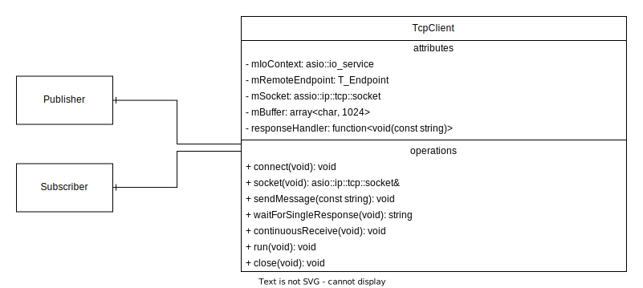

# Dokumentation

Diese Seite beinhaltet eine kurze Dokumentation des Konzeptes hinter der Implementierung.

## Übersicht

| | |
|---|---|
| Version | v1.0.0 |
| Programmiersprache | C++ 17 |

## Third Party Librarys

- **nlohmann/json**<br>
  Verwendet als JSON Parser<br>
  [github](https://github.com/nlohmann/json) | [website](https://json.nlohmann.me/)
- **asio**<br>
  I/O Programming - Verwendet für die Systemunabhängige Socketverwaltung<br>
  [github](https://github.com/chriskohlhoff/asio/) | [website](https://think-async.com/Asio)

## Konzept

Das Model besteht aus drei zentralen Elementen.
Dem Publisher, dem Broker und dem Subscriber.

<p align="center">
  
</p>

Der Broker dient als zentrale Server-Instanz.
Die Publisher und die Subsriber können als Clients betrachtet werden.
Der Publisher publiziert die Nachrichten über den Broker an alle Subscriber, die sich für ein bestimmtes Thema interessieren.
Die Subscriber melden sich dazu zuvor mit der Wahl eines Topics am Broker an.
Der Broker leitet die gepublishten Nachrichten, des Publishers gezielt an die einzelnen Subscriber weiter.
Die Anzahl der Publisher und Subscriber kann variieren.

Nachfolgend werden die relevantesten Klassen beschrieben.

### Globale Helper Klassen

**Request type**<br>
Alle Anfragen an den Broker werden über Request Objekte formuliert.
Je nach geforderter "mAction" werden unterschiedliche Parameter benötigt.
Diese werden in der "mParameterList" definiert.
Ein Parameterelement sieht folgendermaßen aus: `<"Parameterbezeichung", "Parameterwert">`

<p align="center">
  
</p>

**Action Status**<br>
Der Broker antwortet auf alle Requests mit einem Action Status.
Dieser beschreibt, ob der Request erfolgreich abgearbeitet wurde, oder ob ein Fehler aufgetreten ist.

<p align="center">
  
</p>

Zusätzlich kann eine Request weitere Response Informationen beinhalten.
Diese werden je nach Request in einer eigenen Klasse beschrieben.
Die Response-Nachricht reiht die Objekte aneinander.
Als Beispiel: <nobr>`"{ActionStatus};{T_TopicStatus}"`</nobr>

<p align="center">
  
</p>

**Message Parser**<br>
Der Nachrichtenaustausch findet mittles JSON String statt.
Für die Konvertierung existiert eine eigene Klasse "MessageParser".
Das ermöglicht den Austausch von JSON in jede andere beliebige String Struktur, solange diese die relevanten Objektklassen für den Nachrichtenaustausch encoden und decoden kann.

<p align="center">
  
</p>

**Send Request**<br>
Alle Clients verwenden die globalen Funktionen `sendRequest(request)` und `sendRequestWithoutResponse(request)`.

`sendRequest(request)` - für Anfragen mit Response Informationen, neben dem ActionStatus<br>
`sendRequestWithoutResponse(request)` - für Anfragen ohne weitere Response Informationen neben dem ActionStatus

Der ActionStatus wird in diese Funktionen bereits abgehandelt.
Die darüberliegenden Funktionen, die die sendRequest Funktionen verwenden, kennen den ActionStatus nicht.
Sobald die sendRequest Funktion eine Rückgabe zurückgibt kann von einer erfolgreichen Abarbeitung des Requests ausgegangen werden.
Bei einer nicht erfolgreichen Abarbeitung wird innerhalb der sendRequest Methode eine Exception mit den Details geworfen.
Bei einer Implementierung, bei der sich das Programm (nicht wie in diesem Falle bei einem Fehlerfall) beenden soll, können diese Exceptions von außen abgefangen werden.

**Logging**<br>

Der ganze Nachrichtenaustausch wird mitgeschrieben.
Dazu existiert eine zentrale Klasse für das Logging.
Für die Zugriffsverwaltung existiert hierfür ein Mutex.

<p align="center">
  
</p>

### Publisher & Subscriber
Die Clients besitzen für jede mögliche Aktion eine eigene Funktion.

<p align="center">
  
</p>

Da das Unsubscriben einer Nachricht mit dem Beenden eines Clients verbunden ist wird die `unsubscribeTopic` Funktion selbständig beim Beenden des Subscribers aufgerufen.

<p align="center">
  
</p>

### Broker
Der Broker dient als zentrale Server-Instanz.
Alle Clients verbinden sich mit diesem, um Requests zu stellen.
Für jeden möglichen Request existiert eine dedizierte Funktion im Broker, die diese Anfrage abarbeitet.
Die jeweils aufzurufende Funktion wird in der `messageHandler`Methode ermittelt.
Für die korrekte Weiterleitung einer gepublishten Nachricht an alle Subscriber wird eine Liste (kategorisiert nach den Topics) geführt.
Zu jedem Topic wird eine Liste der Subscriber gespeichert.
Für jedes Topic wird ein eigener Thread gestartet der im 10 Sekunden-Takt die letzte gepublishte Nachricht an die Subscriber versendet.
Dazu wird die letzte gepublishte Nachricht im fertigen aussendbaren Request Objekt gespeichert.

<p align="center">
  
</p>


### TCP Connections
Alle Verbindungen zwischen Client und Server werden über TCP abgewickelt.
Den Verbindungsaufbau beginnen immer die Clients.
Verbindungen werden nur bei einem subscribe request aufrecht erhalten.
Alle weiteren Verbindungen werden nach dem Beenden eines Requests wieder geschlossen.

Die eigentilchen Informationen zum jeweligen Endpoint des Clients/Servers werden in einem eigenen Endpoint Objekt gespeichert.

Übernommen wird die Socketverwaltung durch asio.
Für eine simplere Handhabung und die Möglichkeit, die Verbindungsart später einfach austauschen zu können, werden die TCP Sockets in eigenen Objekten erstellt.
Dazu existiert eine `TcpServer` und eine `TcpClient` Klasse.
Jeder Client besitzt ein Objekt vom Typ TcpClient, der Server ein Objekt vom Typ TcpServer.

<p align="center">
  
</p>

Zum Abarbeiten von Requests besitzt der Server noch für jede Tcp Verbindung ein Objekt des Typs TcpConnection.
In diesem werden die Verbindungsinformationen abgespeichert.
So können später auf Requests geantwortet werden, oder Nachrichten an die richtigen Subscriber gepublisht werden.
Durch asio ist eine asynchrone Abarbeitung der einzelnen Requests möglich.

<p align="center">
  
</p>

Der TcpClient bestitz für das Empfangen einer gepublishten Nachricht die Eigenschaft `responseHandler`.
So kann die ausgeführte Funktion, in diesem Falle die Ausgabe der gepublishten Nachricht auf der Konsole, durch eine andere Handlerimplementierung ausgetauscht werden.

---
### Vollständiges Klassendiagramm

([open raw](https://raw.githubusercontent.com/philippthuemler/verteilte_systeme_gruppe7/docs/docs/assets/class-diagramm.svg?token=GHSAT0AAAAAACB7WAXVCFAWQ253ZS3XPTVGZEPCRNA))

<a href="https://raw.githubusercontent.com/philippthuemler/verteilte_systeme_gruppe7/docs/docs/assets/class-diagramm.svg?token=GHSAT0AAAAAACB7WAXVCFAWQ253ZS3XPTVGZEPCRNA">
  <p align="center">
    
  </p>
</a>

## Contributing

### Naming conventions

| object | naming convention | example |
| --- | --- | --- |
| files | snake case | file_name |
| classes | pascal case | ClassName |
| datatype classes | pascal case; suffix “Type” | DatatypeClassType |
| member functions | camel case | memberFunctionName |
| functions | camel case | functionName |
| test functions | pascal case; prefix ‘Test’ | TestFunctionName |
| global variables | pascal case | GlobalVariableName |
| local variables | camel case | localVariableName |
| member variables | pascal case; prefix ‘m’ | mMemberVariableName |
| constants | screaming snake case | CONSTANT_NAME |
| typedefs | pascal case; prefix ‘T_’ | T_TypedefName |

### Git rules

#### Naming conventions

| object | naming convention | example |
| --- | --- | --- |
| branches | kebab case; prefix (3 letters) + “/” | dev/branch-name |

### Commit message

```
:gitmoji: text
```
Verwendung von [gitmoji.dev](https://gitmoji.dev/).

Die Commitmessage wird in Engisch verfasst.
Als Zeit wird "simple present" verwendet (Jeder Commit soll beschreiben was dieser aktiv verändert!)
