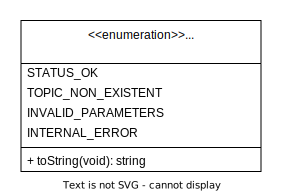
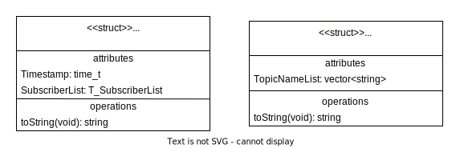
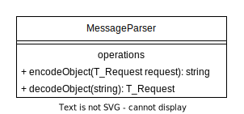
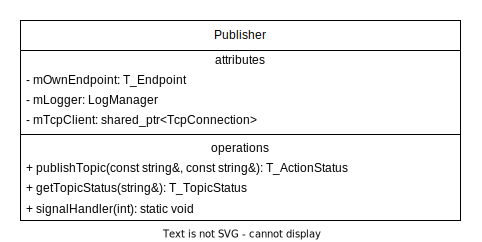

# Documentation

This page contains a brief documentation of the concept behind the implementation.

## Overview

| | |
|---|---|
| Version | v1.0.0 |
| Programming Language | C++ 17 |

## Third Party Libraries

- **nlohmann/json**<br>
  Used as a JSON parser<br>
  [GitHub](https://github.com/nlohmann/json) | [Website](https://json.nlohmann.me/)
- **asio**<br>
  I/O Programming - Used for platform-independent socket management<br>
  [GitHub](https://github.com/chriskohlhoff/asio/) | [Website](https://think-async.com/Asio)

## Concept

The model consists of three central elements: the Publisher, the Broker, and the Subscriber.

<p align="center">
  
</p>

The Broker serves as the central server instance. The Publisher and the Subscriber can be considered as clients. The Publisher publishes messages through the Broker to all Subscribers interested in a specific topic. The Subscriber registers with the Broker by choosing a topic of interest. The Broker forwards the published messages from the Publisher to the respective Subscribers. The number of Publishers and Subscribers can vary.

The most relevant classes are described below.

### Global Helper Classes

**Request type**<br>
All requests to the Broker are formulated using Request objects. Different parameters are required depending on the "mAction" requested, which are defined in the "mParameterList". A parameter element looks like this: `<"ParameterLabel", "ParameterValue">`

<p align="center">
  
</p>

**Action Status**<br>
The Broker responds to all requests with an Action Status, which indicates whether the request was successfully processed or if an error occurred.

<p align="center">
  
</p>

Additionally, a request can contain additional response information depending on the request type, which is described in separate classes. The response message concatenates the objects together. For example: <nobr>`"{ActionStatus};{T_TopicStatus}"`</nobr>

<p align="center">
  
</p>

**Message Parser**<br>
The message exchange occurs using JSON strings. For conversion, there is a dedicated class called "MessageParser". This allows the exchange of JSON with any other string structure, as long as it can encode and decode the relevant object classes for the message exchange.

<p align="center">
  
</p>

**Send Request**<br>
All clients use the global functions `sendRequest(request)` and `sendRequestWithoutResponse(request)`.

`sendRequest(request)` - for requests with response information, in addition to the ActionStatus<br>
`sendRequestWithoutResponse(request)` - for requests without any additional response information besides the ActionStatus

The ActionStatus is handled within these functions. The higher-level functions that use the sendRequest functions are not aware of the ActionStatus. Once the sendRequest function returns, it can be assumed that the request was successfully processed. If the request was not successfully processed, an exception with the details is thrown within the sendRequest method. In an implementation where the program should (unlike in this case) continue running in case of an error, these exceptions can be caught externally.

**Logging**<br>
The entire message exchange is logged, and there is a central class for logging. A mutex is used for access management.

<p align="center">
  
</p>

### Publisher & Subscriber
The clients have their own function for each possible action.

<p align="center">
  
</p>

Since unsubscribing a message is associated with terminating a client, the `unsubscribeTopic` function is automatically called when the Subscriber is closed.

<p align="center">
  
</p>

### Broker
The Broker serves as the central server instance. All clients connect to it to make requests. For each possible request, there is a dedicated function in the Broker that processes the request. The function to be called is determined in the `messageHandler` method. To correctly forward a published message to all Subscribers, a list is maintained (categorized by topics). For each topic, a list of Subscribers is stored. A separate thread is started for each topic, which sends the last published message to the Subscribers every 10 seconds. The last published message is stored in a completed sendable Request object.

<p align="center">
  
</p>


### TCP Connections
All connections between the client and server are handled via TCP. The clients always initiate the connection setup. Connections are only maintained for a subscribe request. All other connections are closed after the request is completed.

The actual information about the respective endpoint of the client/server is stored in a separate Endpoint object.

The socket management is handled by asio. To simplify the handling and provide the flexibility to easily switch the connection type later, the TCP sockets are created in their own objects. There is a `TcpServer` class and a `TcpClient` class. Each client has an object of type TcpClient, and the server has an object of type TcpServer.

<p align="center">
  
</p>

To process requests, the server has a TcpConnection object for each TCP connection. It stores the connection information, allowing responses to be sent later or messages to be published to the correct Subscribers. Asynchronous processing of individual requests is possible due to asio.

<p align="center">
  
</p>

The TcpClient has the `responseHandler` property for receiving a published message. This allows the executed function, in this case, printing the published message to the console, to be replaced by another handler implementation.

---
### Complete Class Diagram

([open raw](https://raw.githubusercontent.com/philippthuemler/verteilte_systeme_gruppe7/docs/docs/assets/class-diagramm.svg?token=GHSAT0AAAAAACB7WAXVCFAWQ253ZS3XPTVGZEPCRNA))

<a href="https://raw.githubusercontent.com/philippthuemler/verteilte_systeme_gruppe7/docs/docs/assets/class-diagramm.svg?token=GHSAT0AAAAAACB7WAXVCFAWQ253ZS3XPTVGZEPCRNA">
  <p align="center">
    
  </p>
</a>

## Contributing

### Naming conventions

| Object | Naming Convention | Example |
| --- | --- | --- |
| Files | Snake case | file_name |
| Classes | Pascal case | ClassName |
| Datatype classes | Pascal case; suffix "Type" | DatatypeClassType |
| Member functions | Camel case | memberFunctionName |
| Functions | Camel case | functionName |
| Test functions | Pascal case; prefix 'Test' | TestFunctionName |
| Global variables | Pascal case | GlobalVariableName |
| Local variables | Camel case | localVariableName |
| Member variables | Pascal case; prefix 'm' | mMemberVariableName |
| Constants | Screaming snake case | CONSTANT_NAME |
| Typedefs | Pascal case; prefix 'T_' | T_TypedefName |

### Git rules

#### Naming conventions

| Object | Naming Convention | Example |
| --- | --- | --- |
| Branches | Kebab case; prefix (3 letters) + "/" | dev/branch-name |

### Commit message

```
:gitmoji: text
```
Using [gitmoji.dev](https://gitmoji.dev/) for commit messages.

The commit message should be written in English. The tense used should be "simple present" (each commit should describe what it actively changes!)

Please let me know if there's anything else I can help you with!
